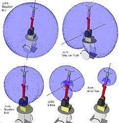
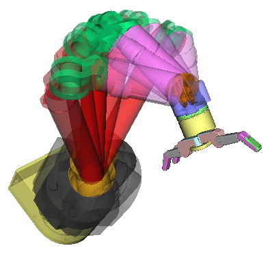
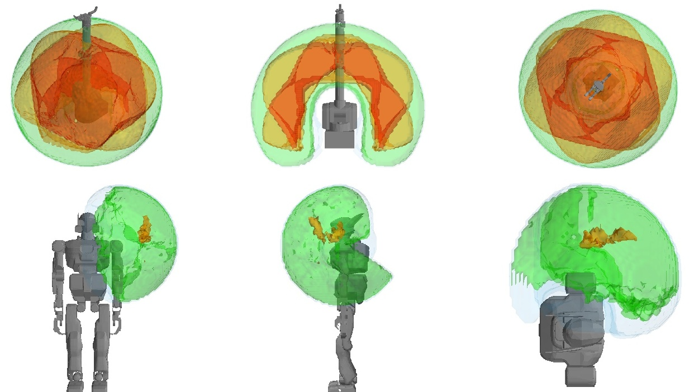
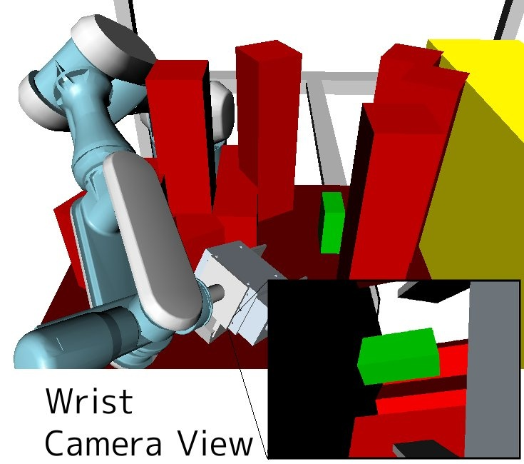

.. _database_generators:

Database Generators
-------------------

.. toctree::
   :maxdepth: 1

   databases/concepts

.. figure:: ../images/databases_convexdecomposition_wam.jpg
  :height: 200
  :figwidth: 100%
  :target: databases/convexdecomposition.html
  :align: center

  convexdecomposition

  linkstatistics

.. figure:: ../images/databases_grasping.jpg
  :height: 150
  :target: databases/grasping.html

  grasping

  inversekinematics

  kinematicreachability

.. figure:: ../images/databases_inversereachability_wam2.jpg
  :height: 200
  :target: databases/inversereachability.html

  inversereachability

  visibilitymodel
